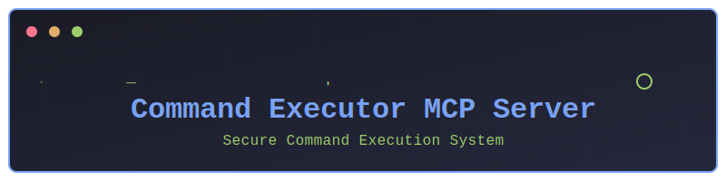

# command-executor MCP Server

<div align="center">
   
   
   <a href="README.md"></a>
   <a href="README.ja.md"></a>
</div>

A Model Context Protocol server for executing pre-approved commands securely.

## Features

- Secure command execution with pre-approved command list
- Configurable allowed commands through environment variables
- Built with TypeScript and MCP SDK
- Communication via stdio for seamless integration
- Error handling and security validations
- Real-time command output streaming

## Installation

Install dependencies:
```bash
npm install
```

Build the server:
```bash
npm run build
```

For development with auto-rebuild:
```bash
npm run watch
```

## Configuration

### Allowed Commands

By default, the following commands are allowed:
- git
- ls
- mkdir
- cd
- npm
- npx
- python

You can customize the allowed commands by setting the `ALLOWED_COMMANDS` environment variable:

```bash
export ALLOWED_COMMANDS=git,ls,mkdir,python
```

### Claude Desktop Integration

To use with Claude Desktop, add the server config:

On MacOS:
```bash
~/Library/Application Support/Claude/claude_desktop_config.json
```

On Windows:
```
%APPDATA%/Claude/claude_desktop_config.json
```

Configuration example:
```json
{
  "mcpServers": {
    "command-executor": {
      "command": "/path/to/command-executor/build/index.js"
    }
  }
}
```

## Security Considerations

The command-executor server implements several security measures:

1. Pre-approved Command List
   - Only explicitly allowed commands can be executed
   - Default list is restrictive and security-focused
   - Commands are validated by prefix to prevent injection

2. Command Validation
   - Command prefix validation prevents command injection
   - No shell execution for improved security
   - Environment variables are properly sanitized

3. Error Handling
   - Comprehensive error handling for unauthorized commands
   - Clear error messages for debugging
   - Failed commands don't crash the server

4. Environment Isolation
   - Server runs in its own environment
   - Environment variables can be controlled
   - Limited system access

## Development

### Project Structure

```
command-executor/
├─ src/
│  └─ index.ts      # Main server implementation
├─ build/
│  └─ index.js      # Compiled JavaScript
├─ assets/
│  └─ header.svg    # Project header image
└─ package.json     # Project configuration
```

### Debugging

Since MCP servers communicate over stdio, debugging can be challenging. We recommend using the [MCP Inspector](https://github.com/modelcontextprotocol/inspector):

```bash
npm run inspector
```

The Inspector will provide a URL to access debugging tools in your browser.

## Tool API

The server provides a single tool:

### execute_command

Executes a pre-approved command.

Parameters:
- `command` (string, required): The command to execute

Example Request:
```json
{
  "name": "execute_command",
  "arguments": {
    "command": "git status"
  }
}
```

Example Response:
```json
{
  "content": [
    {
      "type": "text",
      "text": "On branch main\nNothing to commit, working tree clean"
    }
  ]
}
```

Error Response:
```json
{
  "content": [
    {
      "type": "text",
      "text": "Command execution failed: Command not allowed"
    }
  ],
  "isError": true
}
```

## Error Handling

The server provides detailed error messages for various scenarios:

1. Unauthorized Commands
   ```json
   {
     "code": "InvalidParams",
     "message": "Command not allowed: [command]. Allowed commands: git, ls, mkdir, cd, npm, npx, python"
   }
   ```

2. Execution Failures
   ```json
   {
     "content": [
       {
         "type": "text",
         "text": "Command execution failed: [error message]"
       }
     ],
     "isError": true
   }
   ```

## Contributing

1. Fork the repository
2. Create your feature branch
3. Commit your changes
4. Push to the branch
5. Create a new Pull Request

## License

This project is licensed under the MIT License - see the LICENSE file for details.