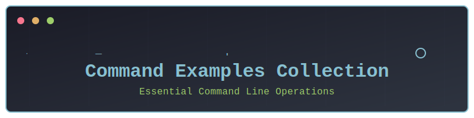

  

# コマンド実行サンプル集

このディレクトリには、様々なコマンドライン操作のサンプルが含まれています。

## 📁 ディレクトリ構成

- [git](./git/): Gitバージョン管理システムの基本的な操作例
  - コミット、ブランチ、リモートリポジトリの操作など
  - `.gitignore`の設定例

- [file-operations](./file-operations/): ファイルシステム操作の使用例
  - ls, dir, mkdir, cdなどの基本コマンド
  - ファイル操作の実践的なサンプル

- [nodejs](./nodejs/): Node.js関連のコマンド例
  - npm, npxの使用方法
  - パッケージ管理とスクリプト実行
  - シンプルなHTTPサーバーの実装

- [python](./python/): Python実行環境とパッケージ管理
  - スクリプト実行とモジュール管理
  - pip、venv環境の使用例
  - 基本的な関数実装サンプル

- [terraform](./terraform/): Terraformインフラストラクチャ管理
  - AWSリソースの設定例
  - 状態管理とワークスペース操作
  - プランとデプロイメントの実行

## 🚀 使用方法

各ディレクトリには、それぞれの分野に特化したREADMEファイルが含まれています。
これらのREADMEには、一般的なユースケースとコマンドの使用例が記載されています。

また、実際に試せるサンプルファイルも用意されていますので、手元で動作を確認しながら学習することができます。

## 📝 注意事項

- 各コマンドは、使用している環境（Windows/Unix系）によって異なる場合があります
- 実際の使用時は、プロジェクトやシステムの要件に応じて適切なコマンドを選択してください
- セキュリティに関わるコマンドは、十分な理解と注意を持って実行してください
